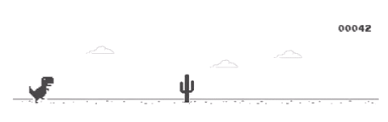

  

  
  
  
  
 

## ✨ Sobre mim

  <b>"Os bilhões são feitos de centavos." - Felippi Crevellari</b>

 

Na área de programação meu foco está no <b>front-end</b>, atualmente estou estudando HTML5, CSS3 e JavaScript. Futuramente pretendo aprender outras linguagens, mas no momento o foco é esse. Não trabalho na área ainda, mas em breve vou estar, por enquanto faço alguns projetos para praticar o que estou aprendendo nos cursos.

  

    

<b>Além da programação...</b>

- Gosto de jogar nas horas livres.
- Adoro ler e assitir sobre casos criminais.
- Já quis ser veterinária, arquiteta e designer de interiores.

 

 

## ✨ Main Skills
 

    
    
  

   

  ## ✨ Tools
&nbsp;
&nbsp;
&nbsp;
&nbsp;
  
   
  
## ✨ Studying in this moment
&nbsp;
&nbsp;

   
  
  
   
  

  
 

  

