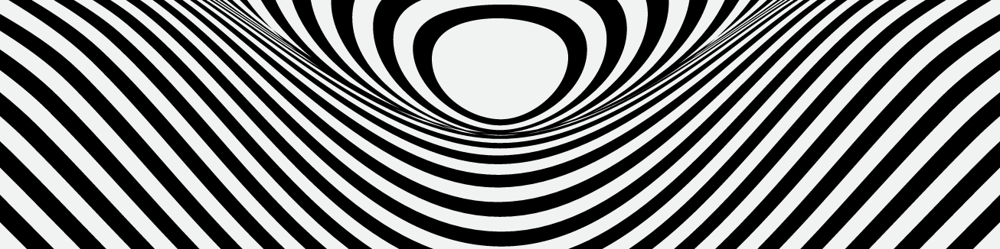

    

        "Os bilhões são feitos de centavos." - Felippi Crevellari
    

     
    

         
         
        
     

         
        

        
Estudo programação com foco em desenvolvimento web. Atualmente estou estudando lógica de programação e JavaScript.

        <h2>Além da programação...</h2>
        <ul>
            <li>Adoro jogar nas horas livres.</li>
            <li>Gosto de ler livros do gênero True Crime.</li>
            <li>Já quis ser arquiteta e design de interiores.</li>
        </ul>
        

        
         

            
            
            
            
            
        

         
        
         
        

            
            
            
        

         
        
         
        

            
        

         
        

